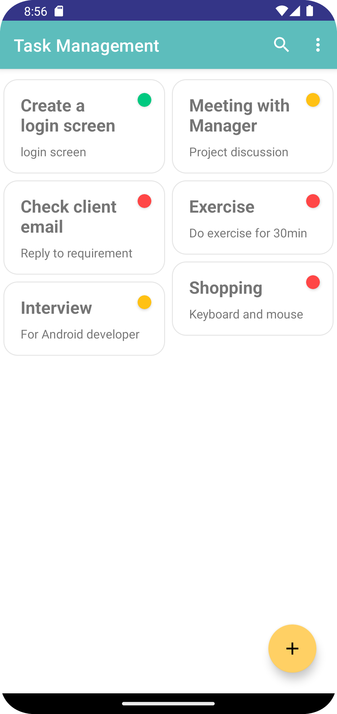
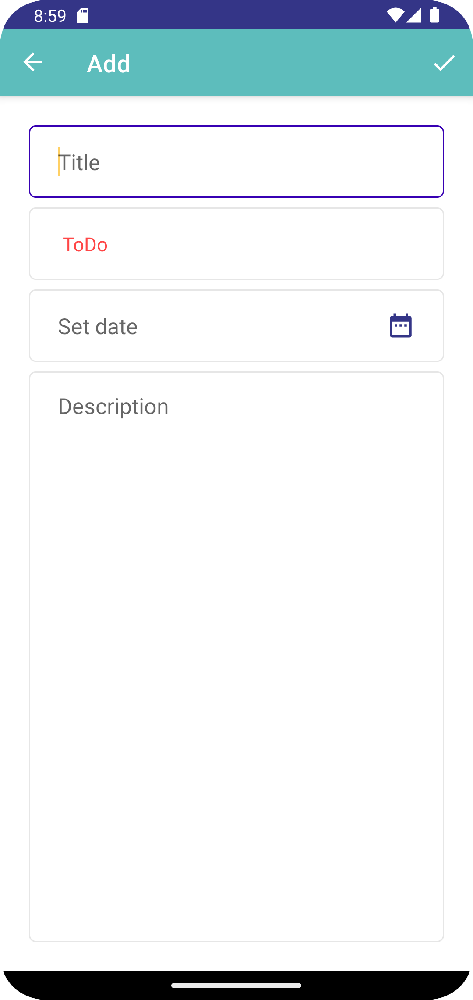
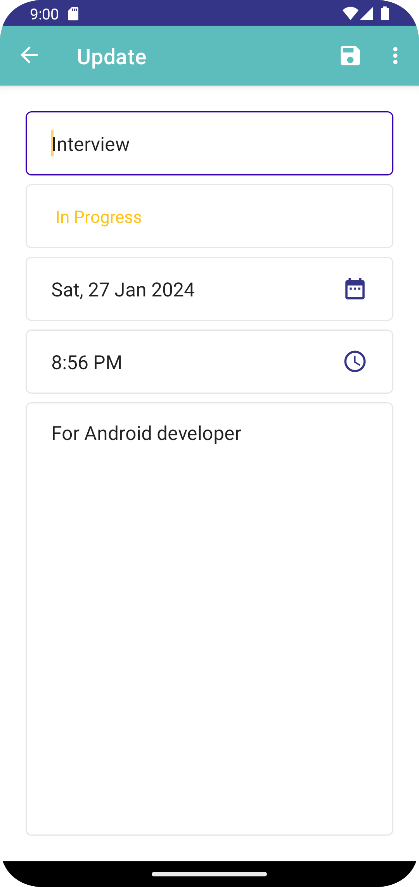
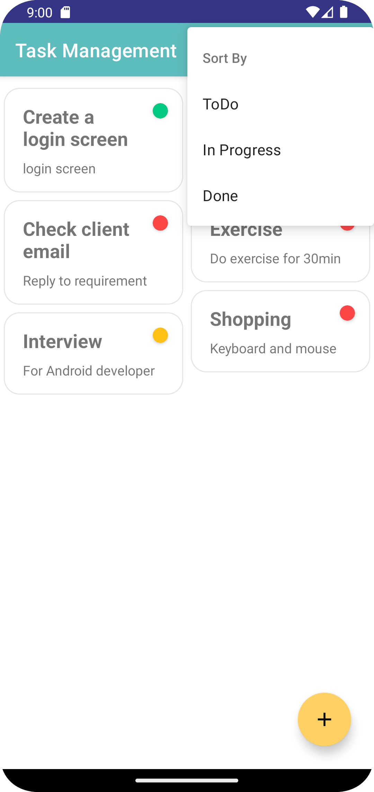
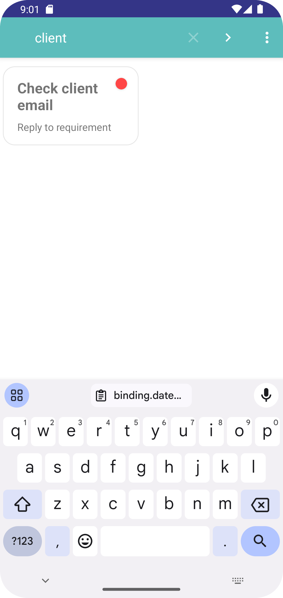

<p align="center">
    <a>
    
    </a>
    <h1 align="center">Task Management App</h1>
</p>

## 🌟 About
A Task Management App that helps you get things done. Built with Kotlin, it helps the user to add/update their task. User can mark an added task as done status . They can delete the completed task or all added task as they wish. It saves the data in local database using Room.

## ✨ Screenshots

<div style="display:flex;">



</div>
<br>
<div style="display:flex;">
  

</div>

## 🚀 Getting Started
These instructions will get you a copy of the project up and running on your local machine for development and testing purposes.

### Prerequisites
*   Android Studio 
*   Java JDK

## 📃 Libraries used
- [Kotlin](https://kotlinlang.org/) - First class and official programming language for Android development.
- [Coroutines](https://kotlinlang.org/docs/reference/coroutines-overview.html) - For asynchronous and more..
- [Room](https://developer.android.com/topic/libraries/architecture/room) - SQLite object mapping library.
- [RecyclerView](https://developer.android.com/jetpack/androidx/releases/recyclerview) - Display large sets of data in your UI while minimizing memory usage.
- [Material Components for Android](https://github.com/material-components/material-components-android) - Modular and customizable Material Design UI components for Android.
- [ViewBinding](https://developer.android.com/topic/libraries/view-binding) - Generates a binding class for each XML layout file present in that module and allows you to more easily write code that interacts with views.

## 🔨 Build and Run Application

Follow this steps to get Working Project!
```
1. Clone this repository or download file
2. Extract zip if downloaded code
3. Open project in Android Studio
4. Wait while Android Studio Download gradle or required files
5. Hit Run Button !
```

